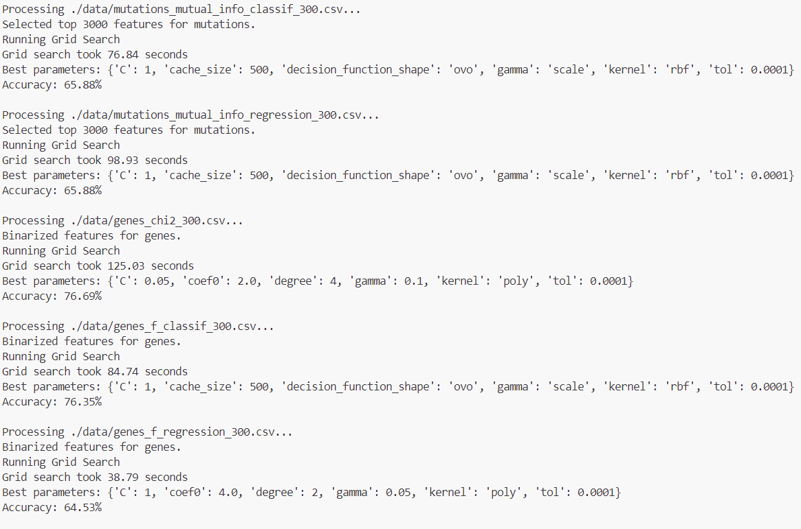

# CS 4060/5060 Machine Learning - Midterm Project

## Project Overview
We are optimizing a Support Vector Machine (SVM) machine learning model on a cancer dataset.

## Group Members and Tasks

- **Colin**: reading in new data file, feature selection

- **Carson**: Paramter selection (Kernels: rbf and Linear)

- **Brock**: Prediction Outputs and Confusion Matrix

- **Dalton**: Parameter selection (Kernels: Polynomial and Sigmoid)

- **Evan**: Optimizing grid search process using distributed computing

## Presentation Links
- [Draw.io](https://app.diagrams.net/#G1lqv_qe5vv9x_S6H3pAuoO-kKlxY2O1tK#%7B%22pageId%22%3A%22bdIwfTm87-16Q-w4N2K_%22%7D)

- [Powerpoint](https://catmailohio-my.sharepoint.com/:p:/r/personal/bk893421_ohio_edu/_layouts/15/Doc.aspx?sourcedoc=%7B581CFF1B-9F24-49E7-A363-F56696FEE269%7D&file=Presentation.pptx&wdLOR=c6B91EE72-0536-A24A-90FD-145F82835B53&fromShare=true&action=edit&mobileredirect=true)

## Grid Search Optimization

### Distributed Computing with Dask

This project leverages Dask, a parallel computing library, to optimize hyperparameter tuning via grid search. Dask enables scalable and distributed computing by breaking tasks into smaller chunks and distributing them across multiple machines.

### Setting Up the Dask Cluster

To facilitate distributed computing, a Dask cluster is set up using `distributed_setup\start_dask_cluster.bat`. This script reads from `distributed_setup\workers.txt`, which contains a list of 36 machines. The first machine in the list is designated as the scheduler, while the remaining 35 act as worker nodes. The script uses SSH with a keypair to log into each machine and start the necessary processes. Each SSH connection opens in a separate command prompt window to ensure persistent connections.

### Parallelizing Grid Search

The grid search process is distributed among the worker nodes to accelerate computation. When initiated, the parameter search is first sent to the Dask scheduler, which then distributes the workload across the available workers. Each worker processes a subset of the hyperparameter combinations, significantly reducing the time required for model training and evaluation. By parallelizing cross-validation folds and parameter evaluations, Dask ensures efficient resource utilization and faster hyperparameter tuning.

By integrating Dask into the grid search, this project effectively optimizes the support vector machine (SVM) hyperparameter search, leading to improved model performance with reduced computation time.

## Output

### Distibuted Setup Output


### Main Distributed Script Output




### Output Graph


## Steps to Run the Project
**NOTE**: You will have to configure an SSH keypair on each lab machine and change the SSH username in `\distributed_setup\start_dask_cluster.bat`
### 1. Navigate to the project folder:
   ```bash
   cd <project_directory>
   ```
### 2. Activate the virtual environment `dask_env`:

   **On Windows:**
   ```bash
   conda activate dask_env
   ```
### 3. Install the required packages:
   ```bash
   pip install -r requirements.txt
   ```
### 4. Start the Dask cluster:
   **On Windows**
   ```bash
   .\distributed_setup\start_dask_cluster.bat
   ```
### 5. Run the project script:
   ```bash
   python src\main_distributed.py
   ```
